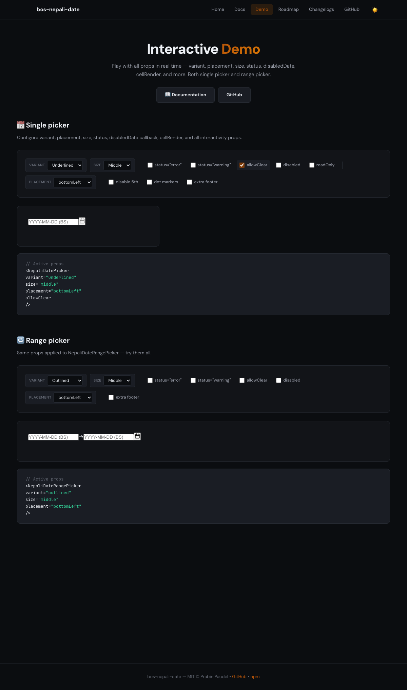

# bos-nepali-date

[**📖 Full Documentation →**](https://prabin194.github.io/bos-nepali-date/)
[**🎮 Live Demo →**](https://prabin194.github.io/bos-nepali-date/)

React-ready Nepali (Bikram Sambat) date picker packaged for reuse. Ships with a pluggable conversion adapter so you can swap in your own BS↔AD tables.

## Live demo

[https://prabin194.github.io/bos-nepali-date/](https://prabin194.github.io/bos-nepali-date/)

## Quick start

```bash
npm install bos-nepali-date
# or, inside this repo
npm install
npm run dev
```

```tsx
import { NepaliDatePicker, defaultAdapter } from 'bos-nepali-date';

function Demo() {
  const [value, setValue] = useState(null);
  return (
    <NepaliDatePicker
      value={value}
      onChange={setValue}
      adapter={defaultAdapter}
    />
  );
}
```

Styles are auto-imported by the component. If your bundler strips CSS side effects, you can import explicitly:
```ts
import 'bos-nepali-date/style';
```

## Adapter

`MemoryBsAdapter` takes a year table: `{ [bsYear]: [12 month lengths] }` plus an anchor mapping BS→AD.

The published `defaultAdapter` currently ships with BS year data for `2000-2099` and exposes that range via `adapter.range`. If you need a different window or a separately maintained dataset, provide your own adapter instance.

```ts
import { MemoryBsAdapter } from 'bos-nepali-date';

const adapter = new MemoryBsAdapter({
  anchorBs: { year: 2000, month: 1, day: 1 },
  anchorAdIso: '1943-04-14',
  yearTable: yourFullTable,
});
```

## Props (NepaliDatePicker)

| Prop | Type | Default | Description |
| --- | --- | --- | --- |
| `label` | `string` | `Select date` | Accessible label text used by the input and optional visible label. |
| `value` | `BsDate \| null` | `null` | Controlled BS date value. |
| `onChange` | `(date: BsDate \| null) => void` | — | Fired on selection or clear. |
| `adapter` | `BsAdapter` | `defaultAdapter` | Conversion engine (BS↔AD). |
| `minDate` / `maxDate` | `BsDate` | — | Clamp selectable range. |
| `disable` | `DisableOptions` | `{}` | Object with disable rules (see below). |
| `menu` | `MenuOptions` | `{}` | Object with display options (see below). |
| `placeholder` | `string` | `YYYY-MM-DD (BS)` | Input placeholder; mask enforces numeric `YYYY-MM-DD`. |
| `inputClassName` | `string` | — | Extra class for the input element (for custom styling). |
| `inputPattern` | `string \| false` | `\d{4}-\d{2}-\d{2}` | Native pattern attribute. Set `false` to remove browser validation. |
| `showLabel` | `boolean` | `false` | Whether to render the built-in label text. |
| `className` | `string` | — | Extra class for the root wrapper. |
| `disabledDate` | `(date: BsDate) => boolean` | — | Callback to dynamically disable individual dates. |
| `open` | `boolean` | — | Controlled popover visibility. Use with `onOpenChange`. |
| `onOpenChange` | `(open: boolean) => void` | — | Called when the popover opens or closes. |
| `size` | `'small' \| 'middle' \| 'large'` | `'middle'` | Picker size variant. |
| `status` | `'error' \| 'warning'` | — | Validation state styling for the input. |
| `allowClear` | `boolean` | `false` | Show a clear button on the input when a value is selected. |
| `disabled` | `boolean` | `false` | Disable the entire picker (no interaction). |

### Locale behavior
- `menu.lang="ne"` renders Nepali month names, weekday abbreviations, and Nepali digits in the grid/header. `onChange` still returns ASCII BS `YYYY-MM-DD`.
- `menu.lang="en"` uses English labels/digits.

### DisableOptions
| Prop | Type | Default | Description |
| --- | --- | --- | --- |
| `disable.today` | `boolean` | `false` | Prevent selecting today. |
| `disable.date` | `BsDate` | — | Disable a single date. |
| `disable.dates` | `BsDate[]` | `[]` | Disable a list of dates. |
| `disable.before` | `BsDate` | — | Disable all dates before this. |
| `disable.after` | `BsDate` | — | Disable all dates after this. |

Disable checks combine with `minDate` / `maxDate`; if any rule matches, the date is not selectable. The `disabledDate` callback is also evaluated alongside these rules.

### MenuOptions
| Prop | Type | Default | Description |
| --- | --- | --- | --- |
| `menu.showMonth` | `boolean` | `true` | Show/hide month selector; hidden still shows current month text. |
| `menu.showYear` | `boolean` | `true` | Show/hide year selector; hidden still shows current year text. |
| `menu.lang` | `'en' \| 'ne'` | `'en'` | Localize month/day labels and digits (emitted value stays ASCII `YYYY-MM-DD`). |
| `menu.firstDayOfWeek` | `0 \| 1` | `0` | Sunday or Monday start. |

## Range Picker (`NepaliDateRangePicker`)

The `NepaliDateRangePicker` component provides date range selection with the same Bikram Sambat support. It shares most props with `NepaliDatePicker`.

```tsx
import { NepaliDateRangePicker, defaultAdapter } from 'bos-nepali-date';

function RangeDemo() {
  const [range, setRange] = useState([null, null]);
  return (
    <NepaliDateRangePicker
      value={range}
      onChange={setRange}
      adapter={defaultAdapter}
    />
  );
}
```

**Range picker props:**
| Prop | Type | Default | Description |
| --- | --- | --- | --- |
| `value` | `[BsDate \| null, BsDate \| null]` | `[null, null]` | Controlled range: `[start, end]`. |
| `onChange` | `(dates: [BsDate \| null, BsDate \| null]) => void` | — | Fired when the range changes. |
| `separator` | `string` | `→` | Separator text between inputs. |
| `endPlaceholder` | `string` | `placeholder` | Placeholder for the end input. |

All other props (`adapter`, `minDate`, `maxDate`, `disable`, `disabledDate`, `size`, `status`, `allowClear`, `disabled`, `open`, `onOpenChange`, `menu`) work the same as the single picker.

**Selection flow:**
1. First click selects the start date — popover stays open.
2. Second click selects the end date — popover closes, `onChange` fires.
3. If second click is before the start, the range auto-swaps.
4. Hover over dates to preview the in-progress range.

## Accessibility
- Escape closes the popover; click-outside also closes.
- Month/year toggles are real buttons with `aria-haspopup`/`aria-expanded`.
- Calendar days expose `disabled` state; input uses numeric mask (`YYYY-MM-DD`).
- Range picker inputs have distinct `aria-label` values for start and end.

## What To Know

- The component is controlled: pass `value` and update it through `onChange`.
- `onChange` returns a structured BS date object, not a formatted string.
- The package is React-only and expects `react` and `react-dom` as peer dependencies.
- The bundled stylesheet is imported automatically, with `bos-nepali-date/style` available as a fallback import.

## Styling

Base styles live in `src/styles/base.css` and are imported automatically. Override CSS variables (see file) to theme.

The picker inherits the host application's font by default. If you need to force a font family, override `--np-font` on a wrapper or on `.np-picker`.

The calendar popover uses a standard width by default: `280px` minimum and `320px` maximum. Override `--np-popover-min-width` and `--np-popover-max-width` if your layout needs a different size.

The range picker popover uses a wider default of `320px` (standard) to `400px` (max) for a better dual-input experience.

Styles are flagged as side effects so bundlers keep them; if your setup drops CSS, import explicitly:
```ts
import 'bos-nepali-date/style';
```

## Variants

Four visual variants are available via the `variant` prop:

| Variant | Description |
| --- | --- |
| `outlined` (default) | Full border around the input |
| `filled` | Subtle background fill, no border |
| `borderless` | No border or background |
| `underlined` | Bottom-border only, minimal style |



### CSS Variables
| Variable | Default | Description |
| --- | --- | --- |
| `--np-font` | inherits host | Font family for picker controls. |
| `--np-popover-min-width` | `280px` | Minimum calendar popover width. |
| `--np-popover-max-width` | `320px` | Maximum calendar popover width. |
| `--np-color-error` | `#ef4444` | Border/bg color for `status="error"`. |
| `--np-color-warning` | `#f59e0b` | Border/bg color for `status="warning"`. |
| `--np-underline-color` | `--np-primary` | Underline border/shadow color for `variant="underlined"` on focus. |
| `--np-underline-border` | `--np-border` | Bottom border color for `variant="underlined"` when idle. |
| `--np-filled-bg` | `#f8f9fa` | Background color for `variant="filled"`. |
| `--np-sm-height` | `24px` | Input height for `size="small"`. |
| `--np-md-height` | `32px` | Input height for `size="middle"`. |
| `--np-lg-height` | `40px` | Input height for `size="large"`. |

## Changelog

### 0.1.17
- Fix the publish pipeline so `prepublishOnly` runs Vitest in non-watch mode during npm releases.

### 0.1.16
- Fix controlled-state sync so external `value` updates refresh the input and visible month.
- Prevent calendar navigation crashes at adapter boundaries and disable unavailable prev/next controls.
- Make the year selector follow the active adapter range, including partial ranges.
- Apply disable and min/max rules consistently to typed input as well as calendar clicks.
- Guard custom-adapter constraint checks so out-of-range rule props do not crash the picker.
- Added regression coverage for controlled rerenders, typed disabled dates, narrow adapter ranges, and out-of-range constraints.

### 0.1.15
- Remove the picker root minimum width so BS date fields can shrink inside narrow filter grids, drawers, and modal forms without overlapping adjacent fields.
- Make the input row and text input explicitly shrink-safe in flex/grid layouts.
- Added regression coverage for constrained side-by-side picker sizing.

### 0.1.13
- Fix calendar popover clipping inside dialogs, drawers, cards, and other overflow-constrained containers.
- Render the picker overlay through a portal and anchor it with viewport-aware fixed positioning.
- Reposition the overlay on scroll and resize while keeping outside-click and keyboard dismissal behavior intact.
- Added regression coverage for portaled popover rendering and outside-click handling.

### 0.1.11
- Stop forcing `Inter/system-ui` as the default picker font.
- Picker controls now inherit the host app font, which avoids incorrect Nepali glyph rendering on systems with problematic fallback fonts.
- Use a standard calendar popover width instead of stretching to the input width.
- Added `--np-popover-min-width` and `--np-popover-max-width` CSS variables for popover sizing overrides.

### 0.1.9
- Make input pattern optional (`inputPattern` prop); allows disabling native validation.

### 0.1.8
- Added `inputPattern` prop; set to `false` to remove native input pattern validation.

### 0.1.7
- Added `inputClassName` for custom input styling.
- Swapped caret for a calendar icon on the trigger.
- Version bump for npm publish.

### 0.1.6
- Bundles now auto-inject CSS (no manual import needed).
- Added tsup config to ensure styles are emitted.

### 0.1.1
- Added localization (`lang=en|ne`) with Nepali digits/labels.
- Added disable rules (single date, list, today, before/after).
- Input mask now normalizes Nepali digits and blocks non-numeric.
- Month/year selectors can be hidden; static labels still render.
- Added Vitest + jsdom tests and fixed edge cases at dataset boundaries.
- Marked package as ESM tooling (`type: module`) and side-effect free.

## Roadmap

- Ship authoritative BS tables (2000–2100) as a data package.
- Range picker + dual calendar view.
- Storybook stories and visual regression coverage.
- Input masking and ARIA refinements.
